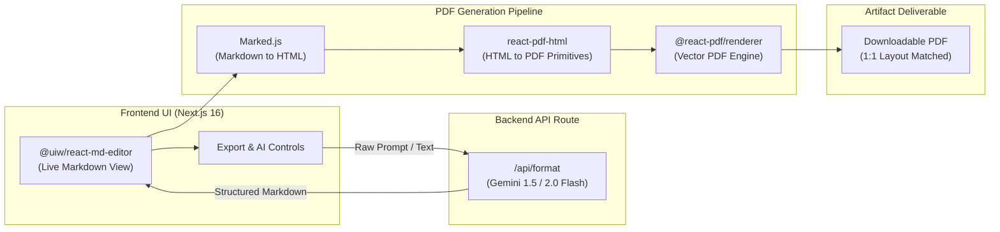

<div align="center">

# ClarityOS (formerly Text-To-Pdf)

**The AI-powered clarity and document operating system for humans who refuse to read walls of text.**

[](https://nextjs.org/)
[](https://react.dev/)
[](https://tailwindcss.com/)
[](https://ai.google.dev/)
[](https://react-pdf.org/)
[](https://opensource.org/licenses/MIT)

*Because turning raw existential dread and messy brain dumps into pristine, structured PDFs should feel like magic, not a root canal.*

[Overview](#overview) • [Key Features](#key-features) • [Architecture](#architecture) • [Getting Started](#getting-started) • [Project Structure](#project-structure) • [Deployment](#deployment)

</div>

---

## Overview

**ClarityOS** (built on our high-performance Text-to-PDF engine) is your personal sanity-preserving operating system. We take raw, unhinged stream-of-consciousness text, meeting transcripts, or late-night brainstorms and run them through advanced LLM structuring intelligence. 

The result? Publication-ready PDF documents with 1:1 layout fidelity, structured headings, clean tables, and zero formatting headaches. 

> *"Like having a meticulous executive assistant who lives inside your browser and doesn't judge your grammar."* — Nobody yet, but we're claiming the quote.

---

## Key Features

- **Split-Pane Markdown Editor**: Real-time side-by-side editing with GitHub Flavored Markdown (GFM) support powered by `@uiw/react-md-editor`.
- **Intelligent AI Restructuring**: Powered by the Google Gemini API to parse unformatted ramblings into:
  - Structured heading hierarchies (`H1` to `H4`)
  - Formatted Markdown tables (because spreadsheets are scary)
  - Styled alert callout boxes for Notes, Warnings, and Pro-Tips
  - Syntax-highlighted code blocks
  - Bulleted and numbered procedural checklists
- **1:1 Pixel-Accurate PDF Generation**: Bridges `@react-pdf/renderer` with `react-pdf-html` and `marked` so your exported PDFs actually look like the preview instead of abstract modern art.
- **Automated Table of Contents (TOC)**: Dynamically indexes document headings and calculates page anchors.
- **Dual Export Modes**:
  - **Raw Text PDF**: Fast, minimal export preserving raw formatting.
  - **AI Enhanced PDF**: Formatted output with typographic hierarchy, badges, callouts, and borders.
- **Zero Lock-in & Privacy**: Runs on your own Gemini API key with client-side PDF rendering. Your secrets stay yours.

---

## Architecture



---

## Getting Started

### Prerequisites

- [Node.js](https://nodejs.org/) v18.18.0 or higher
- [npm](https://www.npmjs.com/) or [pnpm](https://pnpm.io/)
- A [Google AI Studio Gemini API Key](https://aistudio.google.com/) (bring your own caffeine too)

### Installation

1. **Clone the repository:**
   ```bash
   git clone https://github.com/subhwastaken/Text-To-Pdf.git
   cd Text-To-Pdf
   ```

2. **Install dependencies:**
   ```bash
   npm install
   ```

3. **Configure Environment Variables:**
   Create a `.env.local` file in the project root:
   ```env
   GEMINI_API_KEY=your_gemini_api_key_here
   ```

4. **Start the Development Server:**
   ```bash
   npm run dev
   ```

5. **Access the Application:**
   Open your browser and navigate to `http://localhost:3000` and experience true clarity.

---

## Project Structure

```
Text-To-Pdf/
├── public/                  # Static assets and brand icons
├── src/
│   ├── app/
│   │   ├── api/
│   │   │   └── format/      # Gemini API formatting route
│   │   │       └── route.js
│   │   ├── globals.css      # Custom design system & theme variables
│   │   ├── layout.js        # Root application layout
│   │   └── page.js          # Main split-pane workspace
│   └── components/
│       ├── MarkdownPDF.js   # @react-pdf document definition & styling
│       └── PDFDownloadSection.js # PDF preview & download handler
├── package.json
├── next.config.mjs
├── postcss.config.mjs
└── README.md
```

---

## Deployment

### Deploy on Vercel

The fastest way to deploy your ClarityOS instance:

1. Push your repository to GitHub.
2. Import the repository into [Vercel](https://vercel.com/new).
3. Under **Environment Variables**, configure:
   - `GEMINI_API_KEY`: Your Google AI Studio API key.
4. Click **Deploy** and marvel at your new creation.

---

## License

This project is licensed under the [MIT License](LICENSE).
